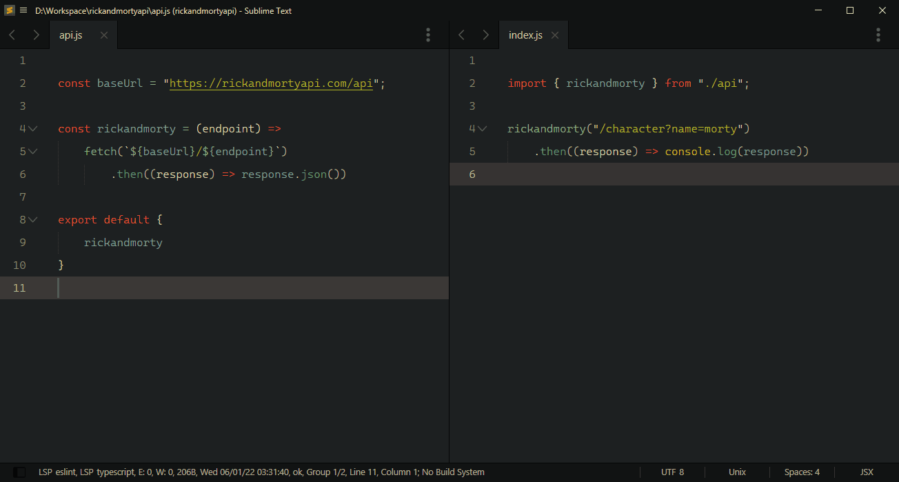

#### Sublime Tips

💡 Show random tips for Sublime Text

Did you know you can `<insert-feature-here>` in Sublime Text?! 🤯

Exactly! This plugin will remind you of random tips that would hopefully improve your workflow.

---

##### Contributing

If you know other tips, edit `tips.txt` and create a pull request!

Here are a few guidelines:
- Make it short and sweet. ST's status message is displayed for 5 seconds.
- Does not need to be a keyboard shortcut. It can also be "facts" (e.g. ST is made by Jon Skinner!)

##### Roadmap

For now, this simply provides tips about default ST keybindings..

- Allow plugins to add their own tips
- Allow plugins to override tips

##### Support

You can always support me via [Patreon](https://www.patreon.com/kapitanluffy)

##### License

[MIT](LICENSE)
